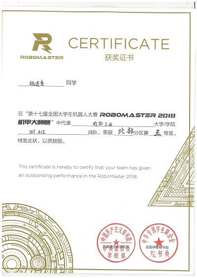
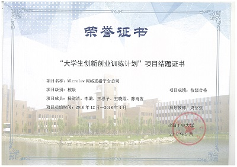
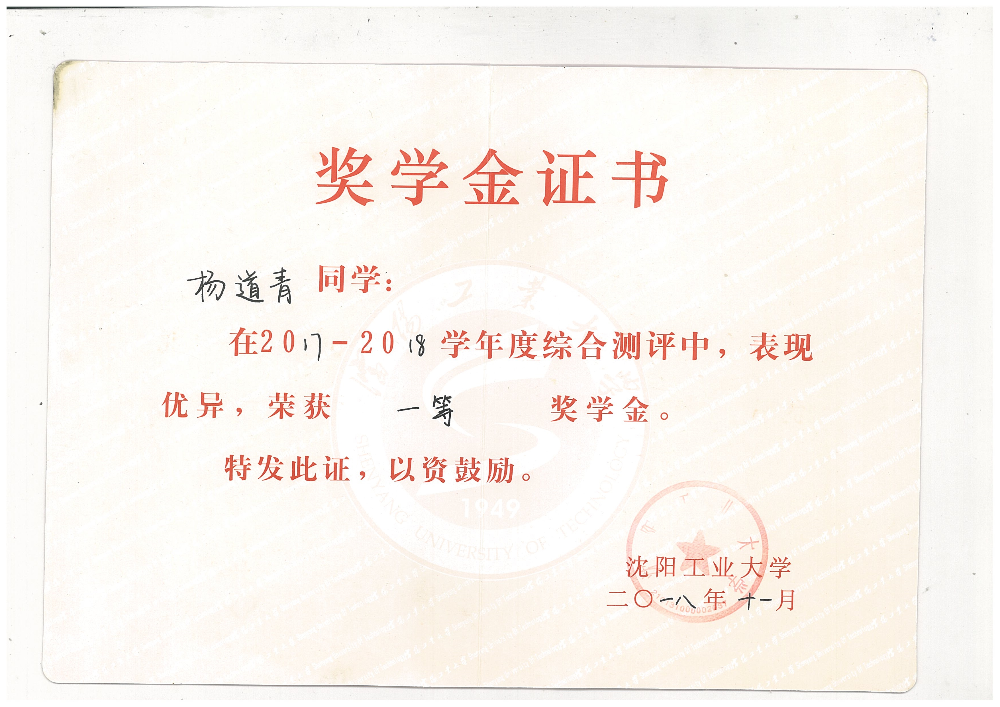
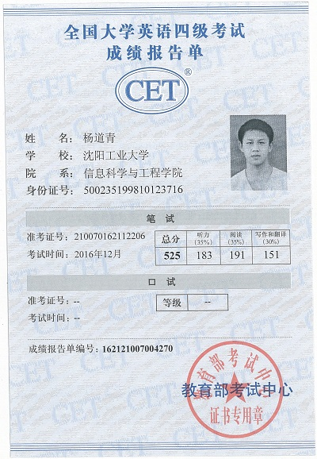
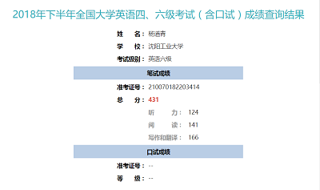

# Certificate
  Past three years,I have taken part in many kinds of interest activities and some clubs,like Robot Innovation,ACM Innovation.There are many gains from club,competition,corporation and some other things.Not only certificate proved my ability,but also I obtained friendship,skills and learned how to get along with other people. Some certificates are shown as following.
# 比赛
>以下为竞赛证书，描述了相应比赛中承担的职责。  
* “第十七届全国大学生机器人大赛 **ROBOMASTER 2018 机甲大师赛**”全国三等奖，担任视觉组组长，完成装甲灯条的识别任务。  

* “视觉识别全自动水果采摘装置”获2018机械创新大赛省三等奖，负责识别水果的任务。  

* “Microlaw网络直播平台公司”获2018年校级证书。  

# 荣誉
>以下证书为学校颁布。
* 2017-2018年度“三好学生”称号。  

* 一等奖学金、国家励志奖学金。   

* 优秀军训学员证书。  

# 文体
>以下证书包含体育竞赛、资格证书、文艺相关。  
* 四六级证书。  
  

* 田径运动会400米栏获奖证书。    

* 信息科学与工程学院“金音天籁，麦动信息”杯主持人大赛。  

* 中软国际2018年度寒假训练营卓越个人奖。  

